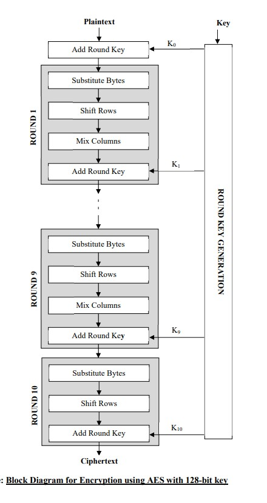

# Advanced Encryption Standard(AES)

Advanced Encryption Standard (AES) is a block cipher based on symmetric key encryption. It encrypts a plaintext of 128 bits into an equal-sized cipher text taking 128, 192 or 256 bits sized secret key performing 10, 12 or 14 rounds of operation respectively. The 128-bit input block is treated as a 4×4 state matrix of bytes on which several rounds of operations are performed using the 128 bits round keys derived from the original secret key to generate equal sized cipher text block. One round of operation (except the last round) comprises of the following four basic operations :

- (a) Substitute Byte: This is a simple look-up based substitution operation, where a 16×16 matrix called S-Box is used for substituting bytes of the state matrix. The first 4 bits of the input data byte act as the row index and its last four bits act as the column index for locating the substituting byte in the S-Box.
- (b) Shift Rows: In this operation the each of the elements (bytes) of the ith row of the state matrix is circularly left shifted i no. of times. The row index starts from 0 and goes till 3 which corresponds to the row index of the last row of the 4×4 state matrix.
- (c) Mix Column: This operation is used to achieve diffusion by multiplying each column of the state matrix with a fixed matrix. Hence, each byte of the column of the state matrix transforms into a new value which is a function of all four bytes present in that column.
- (d) Add Round key: This involves simple bitwise XOR (exclusive-OR) operation between the 128 bits of the state matrix with the 128-bit round key.

Encryption using AES starts with Add Round key operations followed by N_{r-1} rounds (where N_{r} is 10, 12 or 14 for 128, 192, or 256-bit key respectively), each round comprising of Substitute Bytes, Shift Rows, Mix Columns and Add Round Key operations while the last round comprise of Substitute Bytes, Shift Rows and Add Round Key operations. The structure of the decryption procedure is same as that of the encryption in the sense that it also involves Add Round Key operation as the initial step followed by N{r-1} rounds, each round comprising of Inverse Shift Rows, Inverse Substitute Bytes, Add Round Key and Inverse Mix Columns operations. The last round consists of Inverse Shift Rows, Inverse Substitute Bytes, Add Round Key operations. The following figure shows the block diagram for encryption using AES with 128-bit key.

